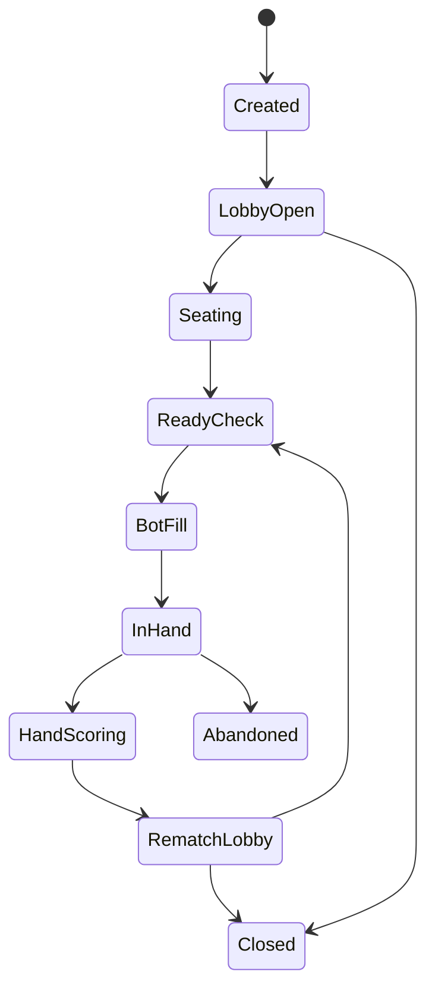

# Feature Doc: Room, Matchmaking, Seats, Teams, and Bot Fill

## 1. Feature summary

The room system lets 1 to 6 human users create or join a game. When a game starts, the app fills any missing active seats with bot users so the hand can begin immediately.

This feature is central to the product because 304 normally requires a fixed number of players. Bot fill removes the biggest barrier to starting a game.

## 2. Goals

- Support rooms with 1 to 6 human users.
- Allow private invite-based play.
- Auto-select a suitable table size.
- Fill empty seats with bots on start.
- Keep team assignments clear and fair.
- Let humans replace bots before a hand starts.
- Preserve a user's seat during reconnects.

## 3. Room lifecycle



### States

| State | Description |
|---|---|
| Created | Room record exists but no full settings confirmed |
| LobbyOpen | Users may join, leave, choose seats, change settings |
| Seating | Host or auto-seat system assigns seats |
| ReadyCheck | Humans confirm they are ready |
| BotFill | Server fills empty seats with bots |
| InHand | Gameplay is active |
| HandScoring | Results and token changes are shown |
| RematchLobby | Players choose rematch or leave |
| Closed | Room no longer active |
| Abandoned | Room ended due to no humans or timeout |

## 4. Room creation requirements

### Required fields

```ts
interface CreateRoomRequest {
  hostDisplayName: string;
  visibility: 'private' | 'public';
  tableSizeMode: 'auto' | 'classic_4' | 'six_6';
  ruleProfileId: string;
  botDifficulty: 'easy' | 'normal' | 'strong';
  allowGuests: boolean;
}
```

### Generated fields

```ts
interface Room {
  id: string;
  inviteCode: string;
  hostUserId: string;
  status: RoomStatus;
  settings: RoomSettings;
  seats: Seat[];
  createdAt: string;
  updatedAt: string;
}
```

## 5. Table size selection

### Auto mode

Auto mode chooses the active table size from human count at the moment the host starts the game.

```ts
function chooseTableSize(humanCount: number): 4 | 6 {
  if (humanCount <= 4) return 4;
  return 6;
}
```

### Manual mode

- `classic_4`: max 4 human players, bots fill to 4.
- `six_6`: max 6 human players, bots fill to 6.

If a fifth human tries to join a 4-seat room:

- Show: “This room is set to Classic 4-seat mode. Ask the host to switch to Six-player mode or join as spectator when spectator mode is available.”
- MVP: do not allow spectator seats.

## 6. Seat model

```ts
interface Seat {
  seatId: string;
  index: number;
  teamId: 'A' | 'B';
  occupantType: 'empty' | 'human' | 'bot';
  userId?: string;
  botId?: string;
  displayName: string;
  connectionStatus: 'online' | 'disconnected' | 'autopilot';
  isReady: boolean;
}
```

## 7. Team assignment

### Classic 4-seat seating

| Seat index | Team |
|---:|---|
| 0 | A |
| 1 | B |
| 2 | A |
| 3 | B |

Partners sit opposite each other.

### Six-seat seating

| Seat index | Team |
|---:|---|
| 0 | A |
| 1 | B |
| 2 | A |
| 3 | B |
| 4 | A |
| 5 | B |

Players are seated alternately so each player is between opponents.

## 8. Bot fill behavior

### Bot fill trigger

Bot fill occurs when:

- Host clicks **Start Game**.
- The room has at least one human.
- The room is not already in hand.
- Active table size is chosen.

### Bot fill algorithm

```ts
function fillEmptySeats(room: Room, tableSize: 4 | 6): Seat[] {
  const seats = createSeatLayout(tableSize);
  copyExistingHumansIntoSeats(room.seats, seats);

  for (const seat of seats) {
    if (seat.occupantType === 'empty') {
      seat.occupantType = 'bot';
      seat.botId = createBot(room.settings.botDifficulty, seat.teamId);
      seat.displayName = generateBotName();
      seat.connectionStatus = 'online';
      seat.isReady = true;
    }
  }

  return seats;
}
```

### Human replacement rules

Before a hand starts:

- A human can take an empty seat.
- A human can replace a bot if the host allows it.
- Replacement must preserve team balance.

During a hand:

- Humans cannot replace bots unless the bot is acting as autopilot for that same user.
- A disconnected user's seat remains reserved.

After a hand:

- Host may replace bot seats with new humans.
- Room may switch mode only if no hand is active and all humans agree.

## 9. Ready check

### MVP behavior

- Host can start if at least one human is present.
- Non-host humans have a ready toggle.
- If host starts while someone is unready, show confirmation.
- Bots are always ready.

### Recommended start button states

| Condition | Start button |
|---|---|
| 0 humans | Disabled |
| 1+ humans, not host | Hidden/disabled |
| Host, no active hand | Enabled |
| Host, room settings invalid | Disabled with reason |
| Host, humans not ready | Enabled with confirmation |

## 10. Invite flow

### Private room invite

- Generate short invite code, e.g. `304-LK7M`.
- Generate shareable URL.
- Users entering link join lobby if room is open.
- Expired or full rooms show useful error.

### Join errors

| Error | User message |
|---|---|
| Room not found | “That room does not exist or has expired.” |
| Room in progress | “This game is already in progress. You can join after the hand if the host allows.” |
| Room full | “This room is full.” |
| Wrong mode | “This room only supports 4 active players.” |
| Banned/blocked | “You cannot join this room.” |

## 11. Public matchmaking

Public matchmaking is P1.

### Casual queue requirements

- User chooses Classic or Six-player.
- User chooses bot fill allowed or humans-only wait.
- Server groups users into rooms.
- If queue time exceeds threshold, offer bot fill.

### Ranked queue requirements

Ranked mode should not launch until:

- Rules are stable.
- Anti-cheat basics exist.
- Reconnect is reliable.
- Bot use in ranked is either disabled or clearly separated.

## 12. Reconnect behavior

### Grace period

When a human disconnects:

1. Seat status becomes `disconnected`.
2. Player has a grace period to return.
3. Timer appears to all users.
4. If the timer expires during an action, bot autopilot may act for that seat.
5. If player returns, they regain control.

### Autopilot vs normal bot

A normal bot is a permanent bot seat.  
Autopilot is temporary control for a disconnected human.

Autopilot must:

- Use only the disconnected player's legal information.
- Make safe, legal moves.
- Be clearly marked in UI.
- Return control immediately on reconnect.

## 13. Edge cases

### Host leaves before game starts

- Transfer host to earliest joined human.
- If no humans remain, close room after timeout.

### Host leaves during hand

- Continue hand.
- Transfer host after hand scoring.

### All humans disconnect

- Pause if possible.
- If no one reconnects before timeout, abandon room.

### Human count changes after bot fill

- Once hand begins, active seats are locked.
- New humans wait until hand ends.

### Team imbalance complaints

- Show seating layout clearly before start.
- Let host shuffle seats before ready check.
- Do not reshuffle teams mid-hand.

## 14. Acceptance criteria

This feature is complete when:

- A room can start with 1, 2, 3, 4, 5, or 6 humans.
- Empty active seats are filled with bots.
- Team layout is correct for 4-seat and 6-seat modes.
- Humans can join by invite link.
- Host can start a room with bot fill.
- Disconnected users can reclaim their seat.
- The server prevents starting invalid configurations.
- Bot seats are visibly identified.
