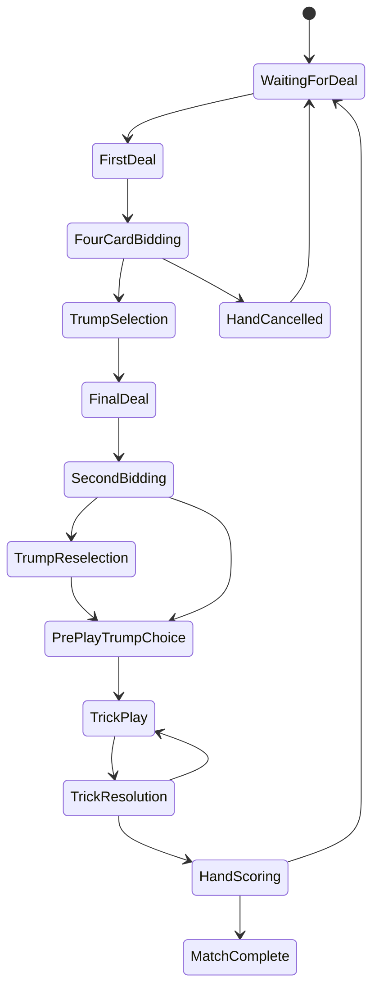

# Feature Doc: Gameplay Engine

## 1. Feature summary

The gameplay engine is the deterministic rules system that runs 304 hands. It must be server-authoritative, testable, and reusable between Classic 4-seat and Six-seat variants.

The client should never decide whether an action is legal. The client may preview likely legality for UI, but the server makes the final decision.

## 2. Engine goals

- Correctly model 304 rules.
- Support configurable seat counts and rule profiles.
- Prevent hidden-information leaks.
- Expose safe public and private state views.
- Record all actions in an append-only event log.
- Allow bots to request legal moves through the same engine as humans.
- Make game states reproducible for debugging.

## 3. Core engine principles

### Deterministic reducer

The engine should be built as a pure reducer:

```ts
function reduceGameState(
  state: GameState,
  action: GameAction,
  context: ReduceContext
): GameState;
```

Given the same state and action, it should always return the same result or validation error.

### Server-authoritative actions

Clients send intents:

```ts
{ "type": "PLAY_CARD", "cardId": "S-J", "seatId": "seat-0" }
```

The server:

1. Authenticates the sender.
2. Maps sender to seat.
3. Validates turn order.
4. Validates legality.
5. Applies action.
6. Broadcasts safe state projections.

### Private state projection

Each player receives a different view:

- Own hand: visible
- Partner hand: hidden
- Opponent hands: hidden
- Bot hands: hidden unless the bot is the user's own autopilot seat
- Face-down trump: hidden except special internal server state
- Played face-down cards: hidden unless revealed by rule

## 4. Game state model

```ts
interface GameState {
  gameId: string;
  roomId: string;
  ruleProfileId: string;
  phase: GamePhase;
  handNumber: number;
  dealerSeatId: string;
  activeSeatId?: string;
  seats: SeatState[];
  teams: TeamState[];
  deck: Card[];
  hands: Record<SeatId, Card[]>;
  trump: TrumpState;
  bidding: BiddingState;
  currentTrick?: TrickState;
  completedTricks: TrickState[];
  scoring: MatchScoringState;
  eventVersion: number;
}
```

## 5. Game phases



### Phase descriptions

| Phase | Description |
|---|---|
| WaitingForDeal | Room ready, no active hand |
| FirstDeal | Initial batch dealt |
| FourCardBidding | Players bid or pass based on first cards |
| TrumpSelection | Highest bidder chooses trump indicator |
| HandCancelled | All players passed or redeal invoked |
| FinalDeal | Remaining cards dealt |
| SecondBidding | Optional high-bid round after full hand |
| TrumpReselection | New high bidder selects new trump indicator |
| PrePlayTrumpChoice | Trump maker chooses open or closed trump |
| TrickPlay | Players play cards to trick |
| TrickResolution | Engine determines trick winner/reveals as required |
| HandScoring | Card points and tokens calculated |
| MatchComplete | Game target reached |

## 6. Action model

```ts
type GameAction =
  | { type: 'START_HAND'; requestedBy: UserId }
  | { type: 'BID'; seatId: SeatId; amount: number }
  | { type: 'PASS_BID'; seatId: SeatId }
  | { type: 'ASK_PARTNER_TO_BID'; seatId: SeatId }
  | { type: 'SELECT_TRUMP_INDICATOR'; seatId: SeatId; cardId: CardId }
  | { type: 'BID_AFTER_FULL_DEAL'; seatId: SeatId; amount: number }
  | { type: 'CHOOSE_OPEN_TRUMP'; seatId: SeatId }
  | { type: 'CHOOSE_CLOSED_TRUMP'; seatId: SeatId }
  | { type: 'PLAY_CARD'; seatId: SeatId; cardId: CardId; playFaceDown?: boolean }
  | { type: 'DECLARE_CAPS'; seatId: SeatId; playOrder: CardId[] }
  | { type: 'DECLARE_SPOILT_TRUMP'; seatId: SeatId }
  | { type: 'ACK_SCORE'; seatId: SeatId };
```

MVP may disable some actions through the active rule profile.

## 7. Validation layers

### Layer 1: Identity validation

- User must belong to room.
- User must occupy the acting seat.
- Bot action must come from server bot controller.
- Spectators cannot send game actions.

### Layer 2: Phase validation

Each action is legal only in specific phases.

| Action | Legal phase |
|---|---|
| BID | FourCardBidding |
| PASS_BID | FourCardBidding, SecondBidding |
| SELECT_TRUMP_INDICATOR | TrumpSelection, TrumpReselection |
| CHOOSE_OPEN_TRUMP | PrePlayTrumpChoice |
| PLAY_CARD | TrickPlay |
| DECLARE_CAPS | TrickPlay, if enabled |
| ACK_SCORE | HandScoring |

### Layer 3: Turn validation

- Action seat must equal `activeSeatId`, except declarations where rule permits.
- Bidding order must be counter-clockwise.
- Trick play order must be counter-clockwise.

### Layer 4: Rule validation

Examples:

- Bid must exceed current bid.
- Bid must respect minimum and increment.
- Trump card must be held by trump maker.
- Player must follow suit if able.
- Player cannot lead the face-down trump indicator except in allowed cases.
- In closed trump, a void follower must use the projected face-down action.
- The maker cannot lead an in-hand trump on trick one or discard an in-hand
  trump as a closed face-down cut while the indicator is available.
- Trick one starts with the player to the dealer's right. Later tricks start
  with the previous winner.

## 8. Legal move generation

The same legal move generator should support:

- UI button availability
- Bot decision making
- Server validation tests

```ts
function getLegalActions(state: GameState, seatId: SeatId): LegalAction[];
```

Legal actions must be based only on the information available to that seat when used by a bot or client.

## 9. Trick resolution

### Inputs

- Led suit
- Trump state
- Cards played
- Face-down cards
- Whether trump has opened
- Rank order from rule profile

### Resolution steps

1. If no face-down cards require inspection, resolve normally.
2. If trump is closed and face-down cards exist, let engine perform trump-maker inspection as a rule step.
3. If one or more face-down cards are trump, record
   `face-down-trump-cut`, reveal the other players' cards needed to resolve the
   trick, and open trump. A maker's face-down non-trump discard stays
   concealed.
4. If the completed first trick has a final bid of 250 or more, record
   `high-bid-after-first-trick`, reveal the indicator and trump suit, and keep
   unrelated face-down non-trumps concealed.
5. Determine winner:
   - Highest trump if any trump in trick is known/revealed.
   - Otherwise highest led-suit card.
6. Move trick cards to winning team pile.
7. Set next leader to trick winner.
8. If all tricks complete, move to scoring.
9. When the room's early-settlement setting is enabled, also settle after a
   complete trick if the bidder has reached the bid or the opponent has made
   it unreachable. Result totals are labeled as points captured when play
   stopped; token tiers do not change.

## 10. Hidden-information handling

### State zones

| Zone | Visibility |
|---|---|
| Own hand | Own player only |
| Other hands | Server/bot owner only |
| Trump indicator face down | Card back only to non-server |
| Revealed trump indicator | Public card identity and suit |
| Face-down non-revealed trick cards | Card back only |
| Completed trick pile | Usually hidden except latest trick review |
| Bid history | Public |
| Scores/tokens | Public |

### Projection API

```ts
function projectStateForSeat(state: GameState, viewerSeatId: SeatId): ClientGameView;
function projectStateForSpectator(state: GameState): ClientGameView;
```

Do not send full `GameState` to clients.

Projected tricks carry only the public reveal reason
(`face-down-trump-cut` or `high-bid-after-first-trick`). They never carry a
hidden card identity as an explanation.

## 11. Event log

Every accepted action becomes an immutable event.

```ts
interface GameEvent {
  eventId: string;
  gameId: string;
  handNumber: number;
  version: number;
  actorSeatId?: string;
  type: string;
  payload: unknown;
  createdAt: string;
}
```

Benefits:

- Debugging rules bugs
- Reconstructing games after crash
- Replay viewer
- Anti-cheat audits
- Bot tuning

## 12. Timers

### Recommended MVP timers

| Phase | Timer | Behavior on timeout |
|---|---:|---|
| Bidding | 30s | Auto-pass, unless forced to bid minimum by rule profile |
| Trump selection | 30s | Bot/autopilot chooses best card |
| Open/closed choice | 15s | Default closed trump |
| Card play | 30s | Autopilot legal move |
| Score acknowledgment | 20s | Auto-continue if majority ready |

Private rooms should allow timers to be relaxed.

## 13. Bot integration

Bots call the same action system as humans.

```ts
const legalActions = getLegalActions(privateBotView, botSeatId);
const chosenAction = botPolicy.chooseAction(privateBotView, legalActions);
server.dispatch(chosenAction);
```

Bots must not inspect full hidden state except their own hand and public history.

## 14. Error handling

### Client-facing errors

| Error code | Message |
|---|---|
| NOT_YOUR_TURN | “It is not your turn.” |
| ILLEGAL_BID | “That bid is not allowed.” |
| MUST_FOLLOW_SUIT | “You have this suit, so you must follow it.” |
| CANNOT_LEAD_TRUMP_INDICATOR | “You cannot lead the hidden trump card now.” |
| GAME_PHASE_CHANGED | “The game moved on. Try again.” |
| SEAT_NOT_FOUND | “Your seat was not found.” |

### Server logging

Log full details server-side, but keep client messages simple.

## 15. Acceptance criteria

The gameplay engine is complete for MVP when:

- It can run a full Classic 4-seat hand in memory.
- It validates all game actions server-side.
- It produces private projections without hidden-card leaks.
- It can run deterministic unit tests from event sequences.
- It handles bot actions through the same action path.
- It can recover current hand state from snapshot + event log.
- It supports a rule profile abstraction that can later run six-seat rules.
