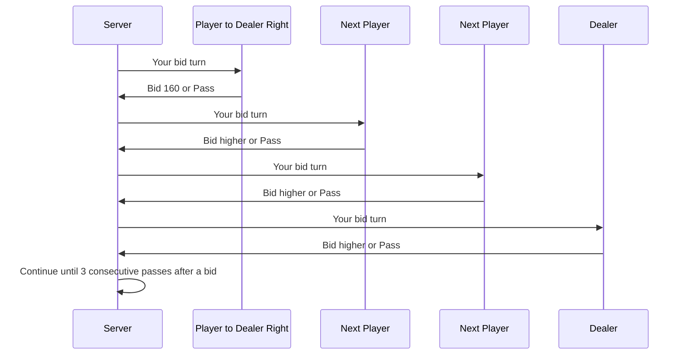

# Feature Doc: Bidding, Trump, and Scoring

## 1. Feature summary

Bidding, trump, and scoring are the heart of 304. The app must make these mechanics clear, correct, and hard to misuse.

The system must support:

- Four-card bidding
- Trump indicator selection
- Optional second bidding round
- Closed/open trump
- Face-down cards before trump opens
- Trick point calculation
- Token scoring
- Caps as a configurable advanced feature

## 2. Bidding UX goals

- Show only legal bid buttons where possible.
- Explain why a bid is disabled.
- Make current highest bid and bidder obvious.
- Show who will act next.
- Keep bid history visible.
- Help beginners understand that bids are point targets, not trick counts.

## 3. Four-card bidding flow



## 4. Bid validation rules

### Required checks

```ts
function validateBid(state: GameState, seatId: SeatId, amount: number): ValidationResult {
  assertPhase('FourCardBidding');
  assertTurn(seatId);
  assertAmountIsNumber(amount);
  assertBidStep(amount, state.ruleProfile.fourCardBidStep);
  assertAtLeastMinimum(amount, state.ruleProfile.minFourCardBid);
  assertGreaterThanCurrentBid(amount, state.bidding.currentBid);
  assertBelowMaximumIfProfileDefinesMax(amount);
  assertBelow200Constraints(state, seatId, amount);
  return ok();
}
```

### Disabled bid explanations

| Condition | UI explanation |
|---|---|
| Below 160 | “Minimum bid is 160.” |
| Not higher than current | “Bid must be higher than the current bid.” |
| Wrong increment | “Bids must increase by the table's bid step.” |
| Second turn below 200 | “After your first bid/pass turn, your next bid must be at least 200.” |
| Partner is current high bidder | “You cannot make a low bid over your partner.” |

## 5. Bid history display

Show a compact log:

```text
East: 160
North: 170
West: Pass
South: Pass
East: 200
North: Pass
West: Pass
South: Pass
Winning bid: East 200
```

For local-style display, optionally show shorthand:

```text
East: 60  (means 160)
North: 70 (means 170)
```

But the UI should always be able to show full values to beginners.

## 6. Trump selection flow

After four-card bidding, the highest bidder sees:

```text
Choose trump indicator card.
The suit of this card becomes trump.
Other players will not see it unless trump opens.
```

Requirements:

- Only cards from the first dealt batch are eligible in Classic four-card trump selection.
- UI should show eligible cards highlighted.
- Clicking card asks for confirmation.
- After selection, card moves to face-down trump zone.

## 7. Open vs closed trump choice

### Screen prompt

After final deal and second bidding resolution:

```text
Trump is selected. Choose how to play this hand:
[Closed Trump] Keep trump hidden until cutting/reveal rules.
[Open Trump] Reveal trump now and return the card to your hand.
```

For a final bid of 250 or more, the prompt also explains that closed trump is
temporary: the indicator and suit open automatically after trick one.

### Defaults

- Default: Closed Trump.
- Practice mode: show explanation.
- If timer expires: Closed Trump.

## 8. Closed trump card play

### Legal face-down play

A player can play face down only when:

- Trump is closed.
- The player cannot follow the led suit.
- The selected card is allowed by the rule profile.

In the implemented Classic profiles, a void follower must play their hand card
face down while trump is closed. The maker cuts with the indicator rather than
discarding another in-hand trump face down. The maker also cannot lead an
in-hand trump on trick one; if no non-trump lead exists, closed mode is not
offered.

### UI behavior

When a player cannot follow suit and trump is closed:

- Show playable cards.
- Provide toggle or prompt: “Play face down?”
- For simplicity, in MVP automatically play face down when required by rules.
- Show card back in the trick area.

### Trick resolution wording

At trick end:

- If no face-down card is trump: “No trump was revealed. Trick goes to highest led-suit card.”
- If a face-down trump cuts: announce that the cut opened trump, expose the
  other players' cards from that trick as required, and keep the maker's
  face-down non-trump discard concealed.
- If the 250+ rule opens trump: announce the high-bid reason, expose the
  indicator and suit, and keep unrelated face-down non-trumps concealed.

## 9. Trump indicator behavior

The trump indicator is not a normal card while face down.

Valid actions:

| Situation | Can play indicator? |
|---|---|
| Lead first trick in closed trump | No, unless open trump was chosen |
| Cut a non-trump trick | Yes, face down |
| Follow led trump while still face down | Special rule applies; may be unable to play it as normal |
| Final trick only card | Yes |
| Trump has opened and returned to hand | Yes, normal trump card |

The engine must model this carefully.

## 10. Second bidding round

The second bidding round happens after all cards are dealt.

### Flow

1. Start with highest four-card bidder.
2. Each player gets one turn.
3. Legal bids must be at least 250 and higher than the current final four-card bid.
4. Highest second-round bidder becomes trump maker.
5. Original trump indicator is returned to original bidder.
6. New trump maker chooses a new indicator from their full hand.

### UX note

Show warning:

```text
A bid of 250 or higher is very ambitious. Trump will open after the first trick by rule.
```

The warning is part of every projected 250+ bid action and is repeated during
trump-mode choice. A second-round player must pass when their partner owns the
current high bid.

## 11. Scoring flow

At hand end, or after a complete trick when the room's early-settlement setting
makes the outcome certain:

1. Preserve unrelated concealed face-down identities.
2. Sum captured team trick points.
3. Compare trump maker team points against final bid.
4. Determine success or failure.
5. Apply token movement.
6. Show hand result screen.

### Hand result screen

Display:

- Final bid and bidder
- Trump suit
- Team A points
- Team B points
- Bid succeeded/failed
- Token movement
- Updated match score
- Notable events: Caps, wrong Caps, spoilt trump, redeal
- Settlement reason: all tricks played, bid reached, or bid unreachable

Early results call the totals “points captured when play stopped” rather than
presenting them as final 304-point totals. The existing token tier is applied
unchanged.

## 12. Token scoring implementation

```ts
interface TokenScoringTier {
  minBidInclusive: number;
  maxBidExclusive?: number;
  successTokens: number;
  failureTokens: number;
}

const classicTokenTiers: TokenScoringTier[] = [
  { minBidInclusive: 160, maxBidExclusive: 200, successTokens: 1, failureTokens: 2 },
  { minBidInclusive: 200, maxBidExclusive: 250, successTokens: 2, failureTokens: 3 },
  { minBidInclusive: 250, successTokens: 3, failureTokens: 4 },
];
```

## 13. Caps

### Product levels

| Level | Behavior |
|---|---|
| MVP | Detect all-trick sweep after hand; no manual claim needed |
| P1 | Manual Caps button; validate if team can guarantee remaining tricks |
| P2 | Strict timing and Wrong Caps penalties |

### Caps UI

If enabled:

- Show **Call Caps** only when rule profile allows.
- On click, player must reveal remaining cards and choose play order.
- Server validates claim.
- If valid, show claim to all players.
- If invalid, apply penalty.

## 14. Scoring acceptance tests

- Bid 160, bidder team gets 170 points: success, +1 token.
- Bid 190, bidder team gets 180 points: failure, -2 tokens.
- Bid 220, bidder team gets 220 points: success, +2 tokens.
- Bid 250, bidder team gets 249 points: failure, -4 tokens.
- Bid 250, trump opens after first trick.
- All-pass hand ends with no token movement.
- Hand with all tricks won marks Caps summary.

## 15. Product copy examples

### Bidding help

> A bid is the number of card points your team promises to win. The deck has 304 total points.

### Trump help

> Trump is the strongest suit for this hand. In closed trump, other players do not know the suit until someone cuts or trump opens by rule.

### Follow-suit help

> You have a card in the led suit, so you must play that suit.

### Scoring help

> Your team bid 200 and won 214 points, so the bid succeeded.
