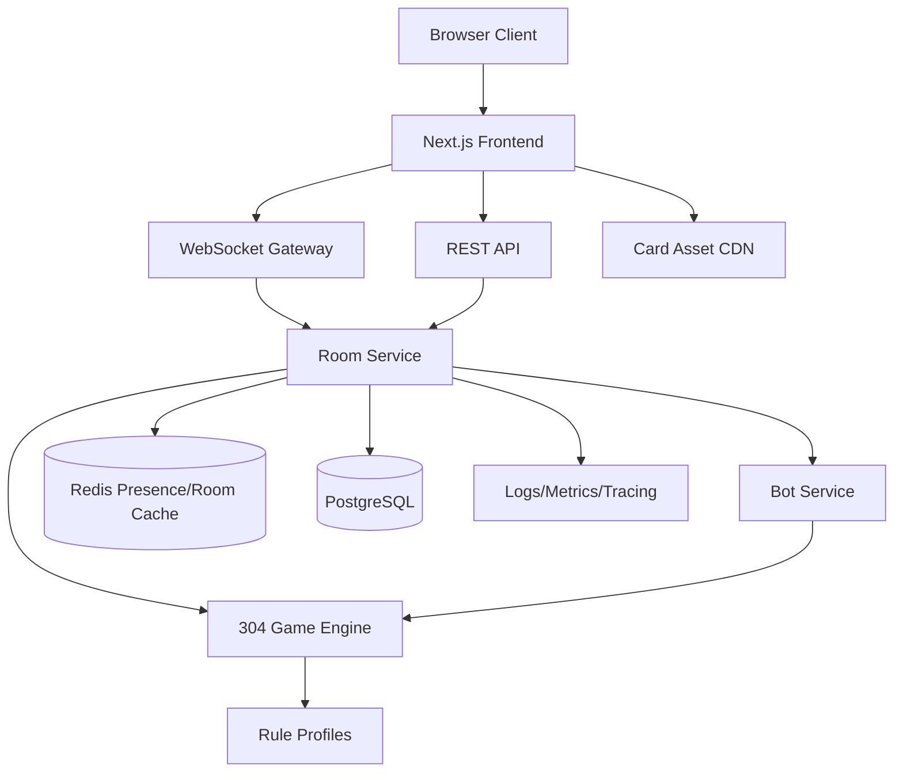
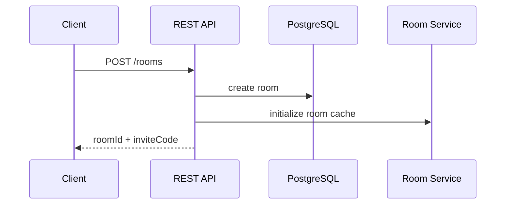
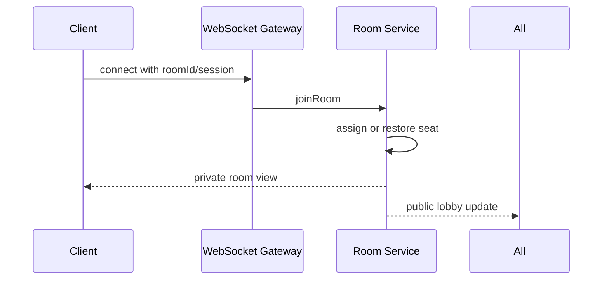
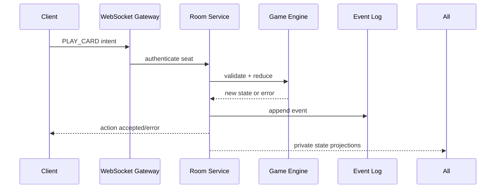
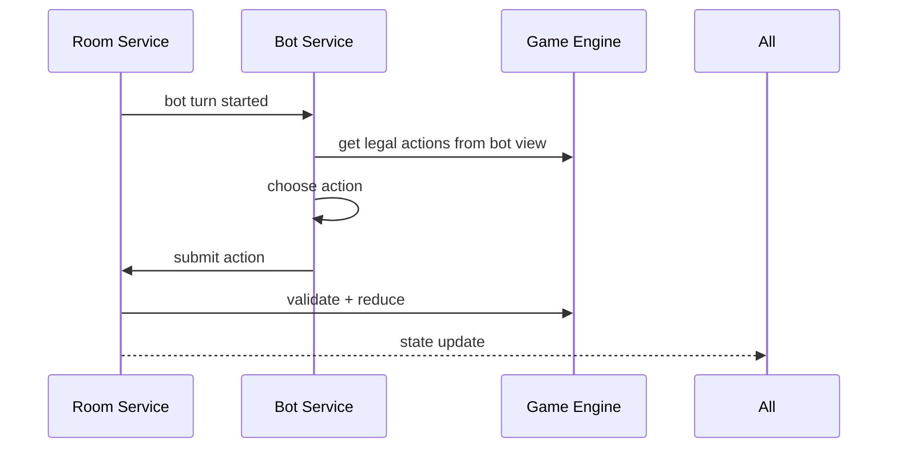

# Architecture Document

## 0. Current stack decision

This repository currently implements a **custom Node.js + static client** architecture in `server.js` and `index.html`.

- This is the active baseline for the codebase today.
- The recommended architecture table is the long-term target shape, not a requirement for the current shipped stack.
- Formal migration criteria and Vercel considerations are captured in `17_FRAMEWORK_AND_HOSTING_DECISION_LOG.md`.

## 1. Architecture summary

304 Online should use a server-authoritative real-time web architecture. The client renders the table and sends player intents. The server validates all actions, updates game state, runs bots, and broadcasts private state projections to each participant.

Recommended stack:

| Layer | Recommended technology |
|---|---|
| Frontend | Next.js + React + TypeScript |
| Styling | Tailwind CSS or CSS Modules |
| Realtime | WebSockets, preferably Socket.IO or native ws with adapter layer |
| Backend | Node.js + TypeScript, NestJS or Fastify |
| Game engine | Shared TypeScript package, pure reducer |
| Database | PostgreSQL with Prisma |
| Realtime/session store | Redis |
| Static assets | CDN/object storage |
| Hosting | Vercel/Netlify for frontend, Fly.io/Render/AWS/GCP for backend |
| Observability | OpenTelemetry + Sentry/Logtail equivalent |

## 2. High-level system diagram



## 3. Core architecture decisions

### Decision 1: Server is authoritative

All final rule decisions happen server-side.

Why:

- Prevents cheating.
- Protects hidden information.
- Keeps bots and humans using the same rule path.
- Makes reconnect and replay reliable.

### Decision 2: Pure game engine package

Create a separate package:

```text
packages/game-engine
```

It should contain:

- Card models
- Rule profiles
- State machine
- Legal action generation
- Reducer
- Scoring
- Projection helpers
- Test fixtures

This package should not depend on React, WebSocket, database, or UI code.

### Decision 3: Append-only event log

Store accepted actions as events.

Why:

- Debugging
- Replays
- Crash recovery
- Anti-cheat audits
- Bot training data

### Decision 4: Private state projections

Never broadcast full state to all clients. Create one view per recipient.

```ts
const views = seats.map(seat => projectStateForSeat(fullState, seat.seatId));
```

## 4. Application components

### 4.1 Frontend app

Responsibilities:

- Landing page
- Room lobby
- Game table UI
- Card interactions
- Bid/trump/scoring panels
- Tutorial/help
- WebSocket connection and state updates
- Local optimistic UI only where safe

Do not:

- Decide move legality as final authority
- Hold other players' hidden cards
- Run permanent bot logic

### 4.2 REST API

Use REST for non-real-time actions:

- Create room
- Join room
- Fetch room metadata
- Login/logout
- Fetch profile/stats
- Fetch rule profiles
- Health check

### 4.3 WebSocket gateway

Use WebSockets for live gameplay:

- Seat updates
- Ready status
- Game actions
- State patches
- Reconnect events
- Timers
- Bot action notifications

### 4.4 Room service

Responsibilities:

- Room lifecycle
- Seat management
- Bot fill
- Human reconnect mapping
- Host controls
- Game start/end coordination
- Broadcasting private views

### 4.5 Game engine

Responsibilities:

- Rule validation
- State transitions
- Dealing
- Bidding
- Trump behavior
- Trick resolution
- Scoring

The engine receives random shuffle results but should not perform infrastructure-level persistence.

### 4.6 Bot service

Responsibilities:

- Create bot identities
- Decide bot actions
- Schedule bot delays
- Handle autopilot for disconnected humans
- Collect bot quality metrics

Bots use engine legal-action APIs.

### 4.7 Persistence layer

PostgreSQL stores:

- Users
- Rooms
- Game sessions
- Events
- Snapshots
- Results
- Stats

Redis stores:

- Presence
- Socket session mapping
- Active room cache
- Timers/locks
- Pub/sub for horizontal scaling

## 5. Runtime data flow

### Create room



### Join room



### Gameplay action



### Bot action



## 6. Deployment model

### MVP deployment

```text
Frontend: Next.js on Vercel or similar
Backend: Node WebSocket service on Fly.io/Render/AWS
Database: Managed PostgreSQL
Redis: Managed Redis
Assets: CDN/object storage
```

### Scaling notes

- WebSocket servers require sticky sessions or shared room ownership.
- Use Redis pub/sub or a room coordinator when scaling beyond one server.
- Route all events for one room to one active room worker.
- Persist snapshots so rooms can migrate or recover.

## 7. Repository structure

```text
304-online/
  apps/
    web/                  # Next.js frontend
    server/               # Realtime/API backend
  packages/
    game-engine/          # Pure rule engine
    bot-ai/               # Bot policies
    shared/               # Shared types/utilities
    ui/                   # Reusable UI components
  prisma/
    schema.prisma
  docs/
    product/
    technical/
  tests/
    fixtures/
```

## 8. Game engine package structure

```text
packages/game-engine/src/
  cards/
    card.ts
    deck.ts
    rank-order.ts
  rules/
    rule-profile.ts
    classic-304.ts
    six-304.ts
  state/
    game-state.ts
    phases.ts
    projection.ts
  actions/
    actions.ts
    validation.ts
    reducer.ts
  scoring/
    card-points.ts
    token-scoring.ts
  tricks/
    legal-card-play.ts
    resolve-trick.ts
  bidding/
    legal-bids.ts
    bid-state.ts
  test-fixtures/
```

## 9. Frontend structure

```text
apps/web/src/
  app/
    page.tsx
    room/[roomId]/page.tsx
    learn/page.tsx
  components/
    Card.tsx
    Hand.tsx
    GameTable.tsx
    BidPanel.tsx
    TrumpPanel.tsx
    ScorePanel.tsx
    SeatBadge.tsx
  hooks/
    useGameSocket.ts
    useRoomState.ts
  lib/
    api.ts
    cardAssets.ts
```

## 10. Backend structure

```text
apps/server/src/
  main.ts
  modules/
    rooms/
    games/
    sockets/
    bots/
    auth/
    stats/
  infra/
    redis.ts
    prisma.ts
    logger.ts
  workers/
    room-worker.ts
```

## 11. State synchronization

### Recommended approach

- Server stores canonical state.
- Clients receive state snapshots after connect/reconnect.
- Clients receive patches or full private views after each action.
- Each update includes `eventVersion`.
- Client discards stale updates.

```ts
interface StateUpdateMessage {
  type: 'GAME_STATE_UPDATE';
  roomId: string;
  eventVersion: number;
  view: ClientGameView;
}
```

## 12. Timers and scheduled work

Timers should run server-side.

Use cases:

- Bid timeout
- Card play timeout
- Bot action delay
- Reconnect grace period
- Room cleanup

Implementation options:

- In-memory timers for single-server MVP
- Redis-backed timers or job queue for scale

## 13. Observability

Log:

- Room created
- Game started
- Action rejected
- Hand completed
- Crash/recovery
- Bot decision latency
- Reconnect success/failure

Metrics:

- Active rooms
- WebSocket connections
- Action latency
- Error rate
- Illegal action count
- Bot fill rate

## 14. Key technical risks

| Risk | Mitigation |
|---|---|
| Hidden card leak | Projection tests and no full-state client broadcasts |
| Rule bugs | Fixture-based test suite and replay event logs |
| WebSocket scaling | Room ownership and Redis adapter |
| Bot delays blocking game | Bot service timeouts and fallback simple policy |
| Reconnect state mismatch | Versioned snapshots and event versions |
| Variant complexity | RuleProfile abstraction from day one |

## 15. Architecture acceptance criteria

The architecture is ready when:

- Game engine can run without database or UI.
- Server can host a room and broadcast private views.
- Clients never receive hidden cards.
- Bot actions go through server validation.
- Game can recover from event log in tests.
- Rule profiles can define 4-seat and 6-seat decks.
