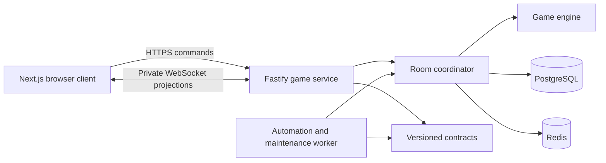

# Architecture

## Current system

304 Online is a server-authoritative browser game. The release-facing client is
Next.js, while a Fastify service and independent worker own all durable game
state and automated actions.

| Boundary | Current implementation | Responsibility |
|---|---|---|
| Web client | `apps/web` (Next.js, React, TypeScript) | Entry, lobby, table, private projections, reconnect UI, accessibility |
| Game service | `apps/game-service` (Fastify, TypeScript) | Guest sessions, authenticated commands, private HTTP/WebSocket views |
| Worker | `apps/game-service/src/worker.ts` | Bot turns, timeouts, disconnected-player autopilot, maintenance |
| Rules | `packages/game-engine` | Deterministic legal actions, transitions, scoring, bot choices |
| Wire contracts | `packages/contracts` | Versioned schemas for commands, responses, projections, and errors |
| Durable state | PostgreSQL | Sessions, rooms, seats, events, snapshots, outbox, automation jobs |
| Coordination | Redis | Leases, presence, rate limits, Pub/Sub, bounded telemetry |
| Compatibility | `server.js`, `index.html`, `src/` | Legacy playable baseline, not the release-facing application |



## Authority and package boundaries

### Browser

The browser sends player intents and renders only validated projections. It
does not import the game engine, calculate outcomes, shuffle cards, infer other
hands, or persist authoritative room state. It recovers through a private HTTP
snapshot whenever a WebSocket version gap or reconnect requires resync.

### Contracts

`packages/contracts` is the wire boundary shared by the web client and game
service. Commands carry an idempotency key and expected room version. Schemas
reject malformed or unsupported payloads before domain code runs.

### Game service

The Fastify service authenticates a high-entropy guest-session cookie, applies
origin and rate-limit policy, resolves the caller's seat, and sends a validated
command to the room coordinator. It never accepts actor identity or a game
snapshot from the client.

### Room coordinator

The coordinator serializes a room mutation under a short Redis lease. In one
PostgreSQL transaction it records the accepted event, updates the private
snapshot, schedules or cancels automation, and creates an outbox notice. A
duplicate command returns its recorded outcome instead of applying twice.

### Engine

`packages/game-engine` is storage-independent and deterministic for a supplied
state/action/random source. It owns Classic four-seat and six-seat 304 rules,
legal actions, bidding, trump, tricks, scoring, match progression, and legal
bot choices. Viewer-specific projections prevent hidden-card and closed-trump
leaks.

### Worker

The worker claims durable automation jobs and submits them through the same
validated coordinator path used for human commands. Bot, timeout, and
autopilot actions are therefore version-bound and retry-safe. A separate
maintenance pass closes only eligible stale lobbies or terminal rooms and
purges data after configured retention; it never advances an active hand.

## Command and update flow

1. The browser creates or resumes a guest session.
2. A guest creates practice/private play or joins by invite code.
3. The service returns a projection containing only that guest's private hand
   plus public room state and server-issued legal controls.
4. The browser submits a command with its idempotency key and expected version.
5. The coordinator validates, reduces, persists, and publishes the next room
   version.
6. The HTTP response and WebSocket update contain only the caller's current
   private projection.
7. Clients discard stale updates and fetch a new snapshot after a version gap.

PostgreSQL remains authoritative during process restarts. Redis can be rebuilt
without losing accepted game history.

## Room lifecycle

Rooms move through lobby, active-hand, hand-result, match-complete, and closed
states. A host starts a private table; empty seats are filled with configured
bots. The host advances a completed result to the next hand or rematch. Human
disconnects use a grace period followed by server-side autopilot, and a
returning guest reclaims the same seat from a fresh private snapshot.

Leaving is permitted only at lifecycle-safe boundaries. Host ownership
transfers to a remaining human, a result-state leaver becomes a bot, and the
last human closes the room. Every lifecycle mutation is evented and versioned.

## Repository structure

```text
apps/
  web/                    Next.js player application and Playwright coverage
  game-service/           Fastify API, WebSocket delivery, worker, tests
packages/
  game-engine/            Deterministic JavaScript rules package
  contracts/              TypeScript wire schemas
infra/
  compose/                Local and AWS-oriented service topologies
  postgres/migrations/    Append-only schema migrations
  monitoring/             Prometheus scrape and alert rules
  load/                   Bounded non-destructive API smoke
scripts/
  backup-restore-rehearsal.sh
docs/
  product/ features/ technical/ planning/ operations/ deployment/
server.js                 Legacy compatibility server
```

## Deployment

The production-like local topology runs the web client, API, worker,
PostgreSQL, and Redis through Docker Compose. The web client is designed for
Vercel; the stateful API and worker are deployed separately. The documented
cost-first launch topology uses AWS Mumbai for API/worker/Redis and Supabase
Mumbai for PostgreSQL.

The provider choice does not change these constraints:

- PostgreSQL is the source of truth.
- Redis is coordination, not history.
- The worker is independently runnable and observable.
- The browser receives only a public API origin.
- Database, Redis, migration, session, and cloud credentials stay server-side.
- Migrations are append-only and application rollback must remain schema
  compatible.

See [the platform decision](13_PLATFORM_AND_SUPPLY_CHAIN.md), the
[development delivery guide](../deployment/vercel-supabase-development.md),
and the [production delivery guide](../deployment/aws-mumbai-production-cost-first.md).

## Operations and verification

The game service exposes `/livez`, `/readyz`, and aggregate metrics. Request
logging redacts cookie and authorization headers; metrics contain aggregate
counters rather than player, room, or card payloads. Release policy also
forbids invite codes, private hands, hidden cards, and raw room snapshots in
logs or downstream evidence. Worker heartbeat, outbox progress, automation
backlog, WebSocket health, migrations, backup/restore, and rollback have
operator runbooks.

Architecture invariants are executable:

- engine and contract unit tests cover rules and wire schemas;
- service tests cover identity, commands, projection privacy, realtime,
  recovery, automation, and maintenance;
- PostgreSQL/Redis integration tests exercise the durable topology;
- Playwright exercises real entry, lobby, complete-hand, reconnect, mobile,
  and keyboard flows;
- CI also runs immutable install, audits, scanners, migrations, Compose
  readiness, bounded load smoke, and backup/restore rehearsal.

The repository demonstrates a local release rehearsal. It does not by itself
prove public deployment, legal approval, alert delivery, production secret
provisioning, or backup-retention ownership.
